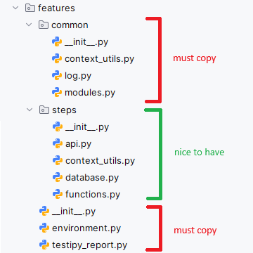
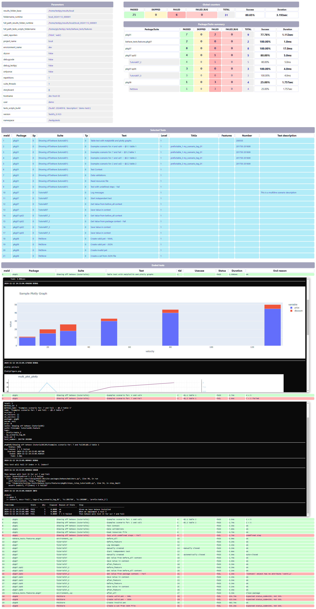

# Run Behave tests using TestiPy as a reporter framework

To have auto-reports done without having to code anything!

You just need to copy some files into your project, and the reporting will be done automatically by collecting everything you send to:
- stderr
- stdout
- log

You can choose as many reporters you need for the same test execution. Common used reporters are `-r web -r html -r junit -r slack`.

# Benefits
- You don't need to do any coding to have a test-run report, just pass the arguments when running behave.
- print and logging is automatically captured and added to the test output run.
- You can have as many kind of reports you want, and if needed you can implement new ones.
- Implement you own reporter based on your needs, and there is no code to be done on the test side.
- Save screenshots along the test output and nicely see it.
- Save graph plots along the test output to easily visualize data.
- See exceptions alongside the test output for each test.

# Setup

1. Have python >= 3.9
2. Copy these files into your project **features** folder:
> 
3. Copy the requirements inside the [requirements.txt](../requirements.txt) file into your project
4. Change these defaults inside [testipy_report.py](./features/testipy_report.py)
```
  TESTIPY_ARGS = f"-tf {BASE_FOLDER} -r web -r-web-port 9204 -rid 1 -r html"
  REMOVE_PACKAGE_PREFIX = "behave_tests.features.
```

# Run tests

Simply add these extra parameters when running your behave tests: 
```
behave -D testipy="-rid 5 -r web -r-web-port 9204 -r junit -r html" behave_tests/features/pkg01 --no-capture --no-capture-stderr
```
- `-rid 5` makes your test results folder to end in 00005. (eg: dev_20241112_000005)
- `-r web` will use the web reporter to see the test results in real-time (uses web-sockets)
- `-r-web-port 9204` will use the HTTPS port 9204 to see the results
- `-r html` will produce an HTML file having all tests results, logging and summary
- `-r junit` will produce a junit xml file

# Report example


# TestiPy homepage
Here you can check out the [TestiPy](https://github.com/pjn2work/TestiPy) Framework